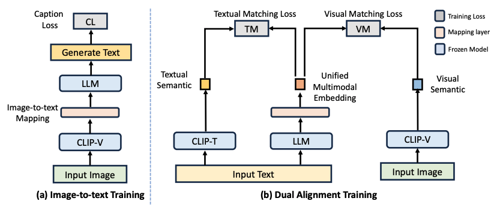

# Unified Embeddings for Multimodal Retrieval via Frozen LLMs


This repository contains the code used for the paper: Unified Embeddings for Multimodal Retrieval via Frozen LLMs

Ziyang Wang, Heba Elfardy, Markus Dreyer, Kevin Small, Mohit Bansal.

## Overview
In this work, We present Unified Embeddings for Multimodal Retrieval (UNIMUR), a simple but effective approach that embeds multimodal inputs and retrieves visual and textual outputs via frozen Large Language Models (LLMs). Specifically, UNIMUR jointly retrieves multimodal outputs via a unified multimodal embedding and applies dual alignment training to account for both visual and textual semantics. Thus, unlike previous approaches, UNIMUR significantly reduces LLM’s modality bias towards generating text-only outputs. Meanwhile, the proposed unified multimodal embedding mitigates the inconsistency between visual and textual outputs and provides coherent multimodal outputs. Furthermore, benefiting from the joint training of visual and textual semantics, UNIMUR also achieves strong image/text retrieval ability.



## Setup 

### Install Dependencies

1. (Optional) Set up a new conda environment, and install the required libraries:
```
conda create -n unimur python=3.8
conda activate unimur
```

2. Install the required libraries
```
pip install -r requirements.txt
```


3. Add the `unimur` library to PYTHONPATH:
```
export PYTHONPATH=$PYTHONPATH:/home/path/to/unimur/
```

### Pretrained Checkpoints

The pruned UNIMUR model weights (linear layers and [RET] embedding) are small and are included in this Git repo. They will be in the `unimur_model/` folder after cloning. The checkpoint and model config in `unimur_model/` reproduce the results reported in our paper.


### Precomputed Embeddings For Image Retrieval

We follow [FROMAGe](https://arxiv.org/abs/2301.13823) which leverages the visual embedding of CC3M images for retrieval. Please follow their instructions, download the files, and place `cc3m_embeddings.pkl` into the `unimur_model/` directory.


## Training

### Preparing CC3M

UNIMUR is trained on the [Conceptual Captions](https://ai.google.com/research/ConceptualCaptions) dataset (main results trained on CC3M). After following the instructions on the website to download the captions and images, format them into a `.tsv` file as follows:

```
caption image
A picture of a dog  dog.png
Tree  tree.png
```
where each line contains the caption followed by the filename of the image files. Save these `.tsv` files into the `dataset/` folder (the default names expected are `cc3m_train.tsv` and `cc3m_val.tsv`). The repo contains two placeholder files, and you will have to replace them with the appropriate data.

The corresponding image files should be saved in the `data/` directory. The directory can be changed with the `--image-dir` runtime flag.


### Training UNIMUR

After preparing dataset as detailed above, you can start a new training job with the following command line flag:

```
randport=$(shuf -i8000-9999 -n1)  # Generate a random port number
python -u main.py \
    --dist-url "tcp://127.0.0.1:${randport}" --dist-backend 'nccl' \
    --multiprocessing-distributed --world-size 1 --rank 0 \
    --dataset=cc3m  --val-dataset=cc3m \
    --opt-version='facebook/opt-6.7b' --visual-model='openai/clip-vit-large-patch14' \
    --exp_name='unimur_exp' --image-dir='image_data/'  --log-base-dir='exp_log/' \
    --batch-size=120  --val-batch-size=80  --learning-rate=0.0003 --precision='bf16'  --print-freq=100
```

On 4 V100-32GB GPU, the model converges within 16 hours (with a batch size of 120). You may also have to disable NCCL P2P with `export NCCL_P2P_DISABLE=1` if you run into issues.


### Pruning Model Weights

As UNIMUR only consists of a few pretrained linear layers and the `[RET]` embedding, we can discard most of the pretrained weights to save on disk space. If you have trained a new model, and wish to do so, you can use `unimur/prune_model_ckpt.py` to prune the model weights. We used the same script to create the weights in the `unimur_model` directory.


## Evaluation

### Preparing Evaluation Datasets
We evaluate our model on [Visual Dialog](https://visualdialog.org/) and [MMDialog](https://github.com/victorsungo/MMDialog) dataset. 

For the VisDial dataset (val split), please download the validation annotation from [here](https://www.dropbox.com/s/ibs3a0zhw74zisc/visdial_1.0_val.zip?dl=0) and the raw image from [here](https://www.dropbox.com/s/twmtutniktom7tu/VisualDialog_val2018.zip?dl=0) and Extract everything to the `VisualDialog` folder. 

For the MMDialog dataset (test split), please follow the download instructions [here](https://github.com/victorsungo/MMDialog). 


### Evaluating on multiple tasks

We provide an evaluation script to reproduce our results on dialogue-to-image retrieval in Visual Dialog (results of Table 3 of our paper). Please change the dataset/checkpoint directory to your configuration. 

```bash
python evals/eval_visdial.py
```

Similarly, we provide scripts to reproduce the multimodal response retrieval results on MMDialog (presented in Table 1 of our paper). To speed up the evaluation process (MMDialog applies different candidate image pools for each dialog), we first extract the visual embedding of all test images using the extract_vis_emb.py (configure your own data/model path). Then, we use the eval_mmdialog.py to reproduce the multimodal response retrieval results (configure the path to your own data/model/saved embedding). 

```bash

python unimur/extract_vis_emb.py

python evals/eval_mmdialog.py
```


## License


